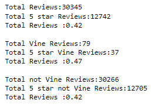

# Amazon Vine Analysis

## Overview
The purpose of this analysis is to see if paid reviewers rate products higher than non paid reviewers. We will be using amazon video game reviews as for this analysis. 

## Results 

* How many Vine reviews and non-Vine reviews were there?
    * We have 79 Vine reviews and 30,266 non-Vine reviews.
* How many Vine reviews were 5 stars? How many non-Vine reviews were 5 stars?
    * We have 37 5 star Vine reviews and 12,705 non-Vine 5 star reviews.
* What percentage of Vine reviews were 5 stars? What percentage of non-Vine reviews were 5 stars?
    *We have 47% 5 star Vine reviews and 42% non-Vine 5 star reviews.
    
## Summary
Based on the information we found, there might be a bias in paid reviews considering there is an increase in 5%. But, without doing a t-test we won't be able to conclude our findings. As you can see the ratio of Vine reviews to non-Vine reviews is drastic and we don't even have 100 Vine reviews meaning our dataset might not be large enough to answer this question. We may want to try using a different dataset that is better targeted towards the Vine audience. One additional analysis we can perform to confirm our answer is checking to see the number of verified purchases. Seeing this shows that none of the Vine reviews have a verified purchase which is a clear indication that there is bias and we shouldn't trust it. 

